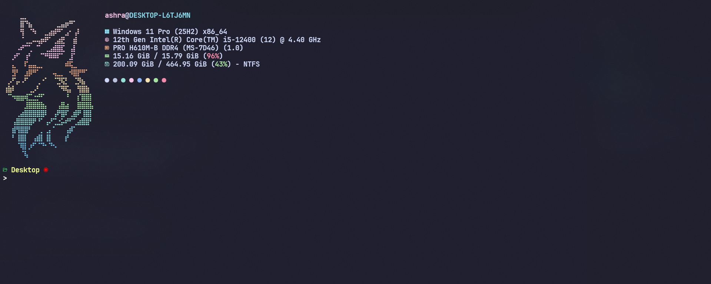

# 💻 Windows Terminal & PowerShell Setup (Dotfiles)

This repository contains my personal Windows Terminal + PowerShell configuration.
It allows me to fully restore my terminal environment on a new Windows device.

---

## 🧩 Included Files

* `powershell_profile.ps1` → PowerShell profile configuration
* `settings.json` → Windows Terminal settings
* `fastfetch/`

  * `config.jsonc`
  * `ascii.txt`
* `README.md` → Setup documentation

---

## 🖥 System Requirements

* Windows 10 / 11
* Internet connection
* Administrator access (recommended)

---

## 1️⃣ Install PowerShell 7 (Required)

### Option A: Using Winget (Recommended)

```powershell
winget install --id Microsoft.PowerShell -e
```

### Option B: Manual Download

Download from:
[https://learn.microsoft.com/powershell/](https://learn.microsoft.com/powershell/)

After install, open **PowerShell (pwsh)** — not Windows PowerShell.

---

## 2️⃣ Install Windows Terminal

```powershell
winget install --id Microsoft.WindowsTerminal -e
```

Restart Windows Terminal after installation.

---

## 3️⃣ Install Nerd Font (Required for Icons)

Install **JetBrainsMono Nerd Font**

```powershell
winget install --id NerdFonts.JetBrainsMono -e
```

After install:

* Open Windows Terminal → Settings
* Font: `JetBrainsMono Nerd Font Mono`

---

## 4️⃣ Install Required CLI Tools

```powershell
winget install Git.Git
winget install JanDeDobbeleer.OhMyPosh
winget install eza-community.eza
winget install junegunn.fzf
winget install ajeetdsouza.zoxide
winget install fastfetch
```

Restart PowerShell after installing tools.

---

## 5️⃣ Install Required PowerShell Modules

Open **PowerShell 7** and run:

```powershell
Install-Module PSReadLine -Force -SkipPublisherCheck
Install-Module Terminal-Icons -Force
```

If prompted, allow NuGet provider installation.

---

## 6️⃣ Apply PowerShell Profile

### Step 1: Find profile path

```powershell
$PROFILE
```

Typical path:

```text
C:\Users\<username>\Documents\PowerShell\Microsoft.PowerShell_profile.ps1
```

### Step 2: Copy profile file

Copy `powershell_profile.ps1` from this repo and paste it as:

```text
Microsoft.PowerShell_profile.ps1
```

Restart PowerShell.

---

## 7️⃣ Apply Windows Terminal Settings

### Step 1: Open Windows Terminal settings file

```powershell
notepad $env:LOCALAPPDATA\Packages\Microsoft.WindowsTerminal_8wekyb3d8bbwe\LocalState\settings.json
```

### Step 2: Replace contents

* Copy `settings.json` from this repo
* Paste & replace existing content
* Save file
* Restart Windows Terminal

⚠️ If needed, update:

* `startingDirectory`
* Font name

---

## 8️⃣ Setup Fastfetch Configuration

Create config directory:

```powershell
mkdir $HOME\.config\fastfetch
```

Copy files:

* `fastfetch/config.jsonc`
* `fastfetch/ascii.txt`

Into:

```text
C:\Users\<username>\.config\fastfetch\
```

Fastfetch will now run automatically on terminal start.

---

## 9️⃣ Verify Everything Works

Restart Windows Terminal → Open **PowerShell**

You should see:

* Oh My Posh prompt
* Icons in `ls`
* `eza` tree view
* `fzf` working with `Ctrl + R`
* `zoxide` smart `cd`
* `fastfetch` output on startup

---

## ⌨ Key Bindings (Highlights)

* `Ctrl + R` → Fuzzy command history
* `Ctrl + T` → Fuzzy file picker
* `Tab` → Menu completion
* `Ctrl + P / N` → History navigation

---

## 🧠 Notes

* Do NOT commit secrets or tokens in profile
* Username paths may need adjustment
* Nerd Font is mandatory for icons

---

## 📸 Screenshots



## Alternative - Follow the install folder for one-command installation


## 🧠 Architecture Overview
flowchart TD
    A[install/install.ps1<br/>One-Command Installer]

    A --> B[Winget]
    B --> B1[PowerShell 7]
    B --> B2[Windows Terminal]
    B --> B3[CLI Tools<br/>oh-my-posh, eza, fzf,<br/>zoxide, fastfetch]
    B --> B4[JetBrainsMono Nerd Font]

    A --> C[PowerShell Modules]
    C --> C1[PSReadLine]
    C --> C2[Terminal-Icons]

    A --> D[powershell_profile.ps1]
    D --> D1[PowerShell Profile Path<br/>$PROFILE]

    A --> E[settings.json]
    E --> E1[Windows Terminal<br/>LocalState/settings.json]

    A --> F[fastfetch config]
    F --> F1[~/.config/fastfetch/config.jsonc]
    F --> F2[~/.config/fastfetch/ascii.txt]

    D1 --> G[PowerShell Startup]
    E1 --> H[Windows Terminal UI]
    F1 --> G
